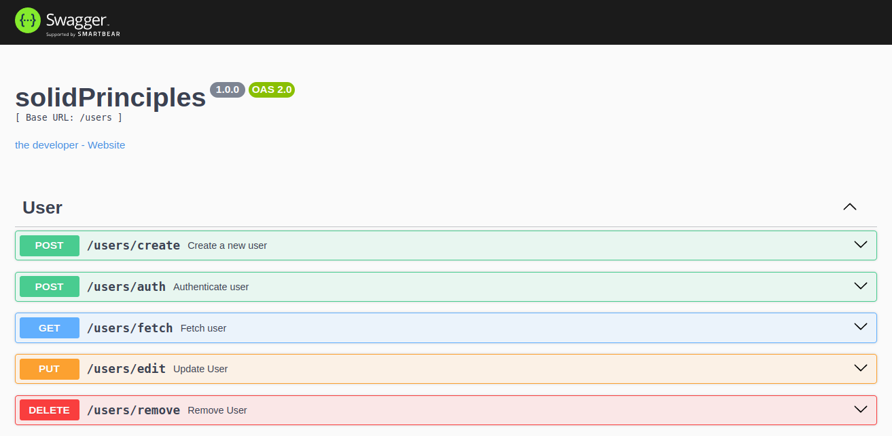
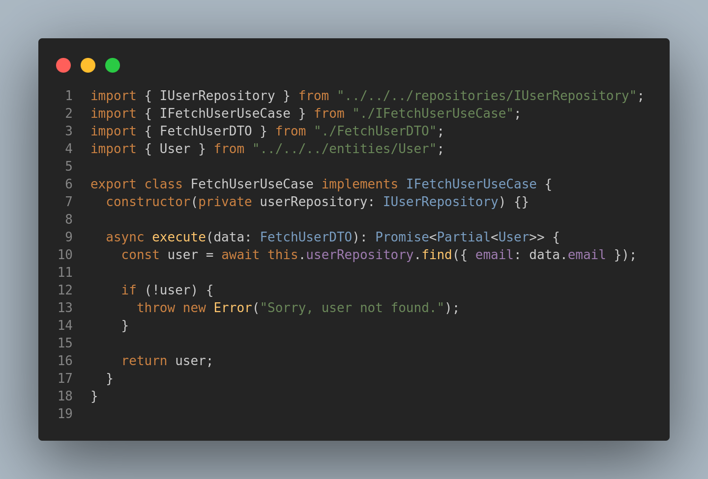

<h4 align="center">
  <br />
  
  <br />
    Solid Principles
  <br />
</h4>

<p align="center">Aplicação criada com base nos <strong>Pricípios SOLID</strong> e <strong>Package By Feature</strong>, além de utilizar recursos como, <strong>Typescript</strong>, <strong>Express</strong>, <strong>PostgreSQL</strong>, <strong>Prisma</strong>, <strong>Jest</strong> e <strong>Docker</strong>.</p>

<h4 align="center">
  
</h4> 

<p align="center">Data de criação: May 8, 2024</p>

<p align="center">
  
  
  
  
</p>




#### Intro 📜

Este projeto tem como foco a implementação dos princípios **SOLID**, nos quais visam trazer para a aplicação mais **flexibilidade**, **escalabilidade** e **fácil manutenção**.

Tais princípios, representados por cada letra do próprio nome.

> [!NOTE]
> - **S** (**Single Responsibility Principle**): Uma classe deve ter apenas uma razão para mudar, ou seja, ela deve ter uma única responsabilidade dentro do sistema.
> - **O** (**Open-Closed Principle**): As entidades/objetos de um software devem ser abertas para extensão, mas fechadas para modificação. Isso significa que quando novos comportamentos forem adicionados, devemos estender e não alterar o código-fonte original.
> - **L** (**Liskov Substitution Principle**): Os objetos de uma classe derivada devem ser substituíveis por objetos de sua classe base sem interromper o funcionamento do programa.
> - **I** (**Interface Segregation Principle**): Uma funcionalidade não deve depender de interfaces que não utilizam. Em vez disso, interfaces específicas devem ser criadas para partes específicas do software.
> - **D** (**Dependency Inversion Principle**): Módulos de alto nível não devem depender de módulos de baixo nível, mas ambos devem depender de abstrações e não das implementações.
>****

Esses padrões facilitam o processo de desenvolvimento de software ao permitir o **reuso**, **dividir** **responsabilidades** e possibilitar a **integração** de diferentes tipos de **banco de dados**. Além disso, tornam a implementação de **testes automatizados**, seja de **testes unitários**, **integração** ou **end-to-end** (**E2E**), mais fácil.

Além do mais, foi implementado o padrão arquitetural **package-by-feature**, diferentemente do **package-by-layer** como na **arquitetura em camadas**, esse padrão foca em organizar código em torno de funcionalidades específicas e centradas no domínio. Todos os componentes de uma funcionalidade são organizados juntos (**controllers**, **useCases**, **DTO**, **Factory** e etc...), o que facilita a compreensão e manutenção, além de outros recursos.

O projeto faz a utilização de `testes unitários` com jest, apesar dos testes serem efetuados em apenas alguns pontos do domínio o app está todo adptado para ser testado.

#### Features 💡

- 📁 Padrão Package By Feature
- ✅ Criar usuário
- 🔐 Autenticação - JWT
- 👾 Informações do Usuário
- 🖊️ Editar Usuário
- 🧹 Deletar Usuário
- ⚡ Dependencies:
  - typescript: `^5.4.5`
  - jest: `^29.7.0`
  - prisma: `^5.13.0`
  - @prisma/client: `^5.13.0`
  - bcrypt: `^5.1.1`
  - cors: `^2.8.5`
  - express: `^4.19.2`
  - express-async-errors: `^3.1.1`
  - joi: `^17.13.0`
  - jsonwebtoken: `^9.0.2`
  - swagger-ui-express: `5.0.0`
  - and more...

#### Execution ⚙️

>
> [!NOTE]
> Siga os passos abaixo para a execução do projeto.

O primeiro passo, é nomear o arquivo `.env.example` para `.env`.

```sh 

# Install Deps
$ cd app && pnpm install

# Docker
$ docker-compose -f "docker-compose-dev.yml" up -d --build

# Tests
$ pnpm test
$ pnpm test:coverage

```

#### Alive 🔋

Após o processo de instalação o serviço estará disponível na porta `3030`. 
Acessando o endpoint `127.0.0.1:3030/doc`, terá a documentação para o uso da `api`.

Em produção, o projeto está hospedado no serviço gratuito da empresa [Render](https://render.com/), rodando todo o app em `docker`.

>
> [!NOTE]
> Por ser um serviço gratuito, leva alguns segundos ou minutos para abrir a conexão, após isso, poderá usar o serviço normalmente.
> 

Link: ([SOLID Principles API](https://solidprinciples-api.onrender.com))

#### Author 🦆

<table>
  <tr>
    <td align="center">
      <a href="https://www.instagram.com/ericneves_dev/">
        
        <br />
        <sub>
          <b>Eric Neves</b>
        </sub>
      </a>
    </td>
  </tr>
  <tr>
    <td>
      <a href="https://www.instagram.com/ericneves_dev/">
        
      </a> 
      <br />
      <a href="https://linkedin.com/in/ericnevesrr"> 
        
      </a>
    </td>
  </tr>
</table>

#### License 📋


